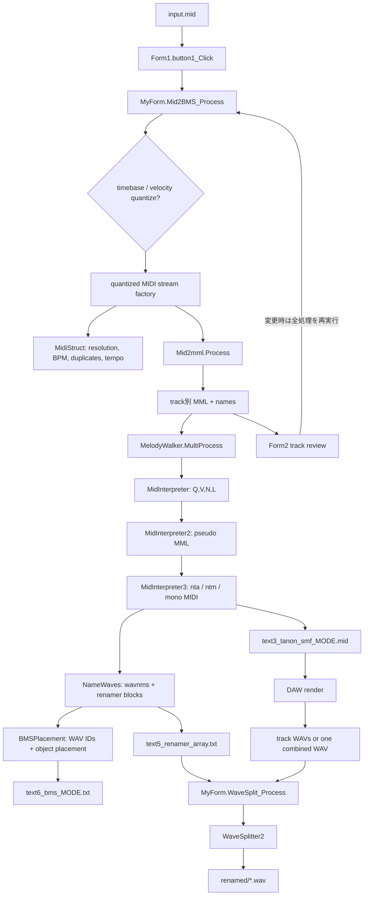

# Phase 0: 現行 Mid2BMS 調査結果

- 調査日: 2026-09-15
- 対象ブランチ: `refactor/260914-ADD_DOCS_AND_FILES`
- 対象コミット: `5d0c3aa`
- 調査範囲: solution/project、ビルド条件、依存関係、主要クラス、MIDIからBMS/WAVまでのデータフロー、モード分岐、中間ファイル、Golden Master候補、移行順序
- このPhaseでの変更: 本文書のみ。アプリケーションコード、project file、設定、生成アルゴリズムは未変更。

## 0. 調査結果の読み方

本文では次の区分を使う。

- **確認済み**: 現在のproject fileまたはコードから直接確認できた事実、あるいは実行したコマンドの結果。
- **推奨**: 後続Phaseで行うべき作業。現時点では未実装。
- **未確認**: ビルド環境またはfixture不足のため、このPhaseでは実行確認できなかった事項。

既存の `呼び出し図.png`、`Mid2BMSの依存関係グラフ.png`、`flowchart_bluemode_2.png` も確認した。ただし、差異がある場合は現在のコードを正とした。

## 1. エグゼクティブサマリー

### 確認済み

1. solutionは、旧形式のC# WinForms実行プロジェクト `Mid2BMS` 1個だけで構成される。
2. ターゲットは.NET Framework 4.0。Debugはx86、Releaseはproject内ではAnyCPUであり、solutionの表示上の`Release|x86`と食い違う。
3. 現環境では再現性のある正常ビルドがまだ成立していない。
   - Visual Studio 2026/MSBuild 18およびVisual Studio 2022/MSBuild 17: .NET Framework 4.0参照アセンブリ不足で`MSB3644`。
   - Windows付属の旧MSBuild 4.8: コンパイルは進むが、Windows SDK 8.0Aの`AL.exe`不足で`MSB3086`。
4. 現行の主要変換経路は次である。

```text
Form1.button1_Click
  -> MyForm.Mid2BMS_Process
     -> MidiStruct                  (timebase/BPM/重複確認、Red用SMF処理)
     -> Mid2mml.Process             (SMFをトラック別MMLへ変換)
     -> MelodyWalker.MultiProcess
        -> MelodyWalker.Process     (トラック単位)
           -> MidInterpreter.Process
           -> MidInterpreter2.walkOnAMelody_Godo
           -> MidInterpreter3.walkOnAMelodyV2
           -> NameWaves.AllNoteToName
           -> BMSPlacement.Process
     -> SoundRunner.CreateText      (WaveSplitter補助ファイル)
     -> MidiTrack.SplitNotes        (Redの単音化/automation切り出し)
```

5. `MyForm`はFormではないが、変換オーケストレーション、ファイルI/O、ハッシュ確認、警告UI、WaveSplitter、DupeDefinitionまで持つ。Application ServiceとUI副作用が混在している。
6. Blue/Purple/Redはトラック設定ではなく、`Form1`で1回だけ決まる2つのglobal boolとして処理全体へ渡る。
7. `NameWaves.wavnms`、`BMSPlacement.wvs`、`nta`/`ntm`は同じindex順で暗黙対応する。これが現行のキー音identity、ファイル名、WAV ID、BMS配置の結合点である。
8. `text5_renamer_array.txt`は明示的な型を持たないブロック形式であり、WaveSplitterが位置依存で読む。
9. 通常命名では`NameWaves`がBMSの名前とWaveSplitter出力名を同時生成するので一致する。連番命名ではWaveSplitterが`text5_renamer_array.txt`を迂回するため、BMS側の`#WAV`定義は更新されない。
10. `tests` projectは存在しない。一方、`Mid2BMS/_Testcase`にBlue/RedのMIDI、Reasonファイル、正解らしきOGGがあり、最初のfixture候補になる。ただしコードから参照されておらず、期待値としての成立条件は未確認である。

### 推奨

最初の実装Phaseは「modern .NETへの移行」ではなく、次の2段階にする。

1. **Phase 1A: legacy buildの再現**
   - .NET Framework 4.0のtargetを維持したまま、参照アセンブリを再現可能に供給する。
   - Debug/Releaseのplatform差を記録し、まずDebug x86を正規baselineとする。
2. **Phase 1B/2: headlessなcharacterization harnessとGolden Master**
   - UIを通さず既存クラスを呼ぶ薄いharnessを作る。
   - 既存アルゴリズムを変更せず、Blue/Purple/Red、Chord、Drums、OneShot、SequenceLayerを固定入力で採取する。

その後に `.NET Framework 4.8 -> SDK-style net48 -> Core/UI分離の足場 -> net10.0-windows` と進めるのが安全である。

## 2. solution / project構成

### 確認済み

`Mid2BMS.sln`はVisual Studio 2013形式で、次の1 projectのみを含む。

| solution項目 | 内容 |
|---|---|
| Project | `Mid2BMS/Mid2BMS.csproj` |
| Project type | C# (`FAE04EC0-301F-11D3-BF4-00C04F79EFBC`) |
| Output | `WinExe` |
| Root namespace / assembly | `Mid2BMS` / `Mid2BMS` |
| Target framework | `.NET Framework 4.0` |
| Project style | 非SDK形式、明示的な`Compile Include` |
| Solution configurations | `Debug|x86`, `Release|x86` |
| Project platform | Debug=`x86`, Release=`AnyCPU` |

根拠: [`Mid2BMS.sln`](../Mid2BMS.sln)、[`Mid2BMS.csproj`](../Mid2BMS/Mid2BMS.csproj#L1-L75)

`src/`、`tests/`、`Directory.Build.props`、`global.json`、`packages.config`、`PackageReference`は存在しない。

project directoryには存在するが、現在の`csproj`でコンパイルされないC#ファイルが4個ある。

| 非コンパイル対象 | 現行側 |
|---|---|
| `DynamicJson.cs` | 同内容の`DynamicJson/DynamicJson.cs`がコンパイル対象 |
| `Mid2mml/Mid2Mml2.cs` | `Mid2mml/Mid2mml.cs`が現行経路 |
| `WaveSplitter/IWaveSplitter.cs` | `WaveSplitter2`はinterfaceを実装していない |
| `WaveSplitter/WaveSplitter.cs` | `WaveSplitter2.cs`が現行経路 |

`DynamicJson.cs`の2コピー、および`NVorbis/NVorbis.dll`と`Mid2BMS/NVorbis.dll`はそれぞれSHA-256が一致した。

## 3. ビルドに必要な環境

### projectから確認できる条件

- Windows
- .NET Framework 4.0のreference assemblies
- WinForms/System.Drawingを扱えるMSBuild
- `.resx`から日本語satellite assemblyを作るためのassembly linker (`AL.exe`)
- `../NVorbis/NVorbis.dll`
- Debug baselineではx86

`app.config`も`.NETFramework,Version=v4.0`を指定している。根拠: [`app.config`](../Mid2BMS/app.config)

### 2026-09-15時点のローカル実測

| 実行方法 | 結果 |
|---|---|
| VS 2026 MSBuild 18.4 / Debug x86 | 失敗: `MSB3644` (.NET Framework 4.0 reference assembliesなし) |
| VS 2026 MSBuild 18.4 / Release x86 | 同上 |
| VS 2022 MSBuild 17.13 / Debug x86 | 同上 |
| `C:\Windows\Microsoft.NET\Framework\v4.0.30319\MSBuild.exe` / Debug x86 | C#コンパイルまでは進行。その後`MSB3086` (`AL.exe` / Windows SDK 8.0Aなし) |

インストール済み環境には.NET SDK 9.0.201/10.0.200、.NET Framework 4.8 runtime/developer files、VS 2022/2026がある。一方、`v4.0` reference assemblies directoryには日本語XML等だけがあり、トップレベルDLLがない。

Microsoftは、対応するDeveloper Packを入れられない環境では`Microsoft.NETFramework.ReferenceAssemblies` NuGet packageで.NET Framework参照アセンブリを供給できるとしている。Phase 1では、古いWindows SDKのマシン依存インストールより、このpackageを開発専用依存として固定する案を優先評価する。公式情報: [Build apps against Microsoft.NETFramework.ReferenceAssemblies](https://learn.microsoft.com/en-us/dotnet/framework/migration-guide/reference-assemblies)

### 未確認

- 正規の.NET Framework 4.0 Developer Pack/Windows SDKが揃った環境での警告なしビルド。
- 生成されたEXEの起動と全画面操作。
- ReleaseのAnyCPUが意図されたものか、実際にはx86前提なのか。

## 4. .NET Framework依存

### 確認済み

projectが明示参照するframework assemblyは次のとおり。

```text
System
System.Core
System.Runtime.Serialization
System.Web
System.Xml.Linq
System.Data.DataSetExtensions
Microsoft.CSharp
System.Data
System.Deployment
System.Drawing
System.Windows.Forms
System.Xml
```

直接の強い依存はWinForms、System.Drawing、DataSet/DataTable、`.resx`、旧設定designer、`app.config`である。

`System.Web`は`Form1.cs`にusingがあるだけで、API利用は見つからなかった。`System.Deployment`のAPI利用も見つからなかった。したがって、この2参照は削除候補だが、削除はbaseline buildとGolden Master確立後に行う。

## 5. 外部ライブラリ一覧

| 依存 | 形態 | 現行コードでの利用 | 判定 |
|---|---|---|---|
| NVorbis 0.8.0.3 | `../NVorbis/NVorbis.dll`へのassembly reference | namespace/API参照は静的検索で見つからない | **参照は確認済み、実利用は未確認。削除候補** |
| DynamicJson 1.2.0.0 | vendored source `DynamicJson/DynamicJson.cs` | `Form1`の`ctrl.json`保存/読込 | **利用中** |
| Soramimi JCode | vendored source `JCode/Jcode.cs` | `HatoEnc`の`SILVERLIGHT`条件内のみ | **desktop buildでは実質未使用と判断** |
| OggVorbisInterop/libvorbisfile | repository内のnative DLL/lib/exp | solution/projectから参照なし | **現行build対象外** |
| NVorbis OpenTK/NAudio support | repository内DLL | project参照なし | **現行build対象外** |

根拠: [`Mid2BMS.csproj`](../Mid2BMS/Mid2BMS.csproj#L60-L75)、[`Form1.cs`](../Mid2BMS/Form1.cs#L967-L998)、[`HatoEnc.cs`](../Mid2BMS/Util/HatoEnc.cs#L21-L80)

なお、`DupeDefinition`がOGG長を読む際はNVorbisではなく、独自の[`IO/VorbisReader.cs`](../Mid2BMS/IO/VorbisReader.cs)を使う。

## 6. modern .NET移行を妨げそうなAPI・構造

### 優先度: 高

1. **Core相当コードからWinForms UIを直接呼ぶ**
   - `MyForm`、`MelodyWalker`、`MidiStruct`、`MidiTrack`、`HatoEnc`等が`MessageBox`を呼ぶ。
   - 自動テストが入力内容や実行時間によってダイアログ待ちになる。
2. **ambient filesystem/current directory依存**
   - `PathBase`等の文字列連結で入出力する。
   - `culture.ini`、`encoding.ini`、`ctrl.json`はcurrent directory相対。
   - `HatoEnc`の初回利用が`encoding.ini`を作成する副作用を持つ。
3. **Shift_JIS code page**
   - `Encoding.GetEncoding("Shift_JIS")`を使用する。
   - modern .NETではcode page provider登録が必要。公式情報: [Encoding.RegisterProvider](https://learn.microsoft.com/en-us/dotnet/api/system.text.encoding.registerprovider?view=net-10.0)
4. **暗黙index契約**
   - `NameWaves.wavnms[i]`、`BMSPlacement.wvs[i]`、`nta[i]`または`ntm[i]`が対応する。
   - `text5_renamer_array.txt`も`String[]`の位置で意味が決まる。
5. **global modeとmutable static設定**
   - `isRedMode`/`isPurpleMode`は処理全体に適用される。
   - Red sequence処理は`MidiTrack.SPLIT_BEATS_*` static fieldを書き換える。

### 優先度: 中

1. **`Process.Start(string)`**
   - 関連付けアプリでテキストやURLを開く箇所がある。
   - modern .NETでは`UseShellExecute`の既定値が.NET Frameworkと異なるため明示が必要。公式情報: [Breaking changes from .NET Framework to .NET](https://learn.microsoft.com/en-us/dotnet/core/compatibility/fx-core)
2. **古い`.resx`とsatellite resource**
   - `Form1.ja-JP.resx`/`Form2.ja-JP.resx`があり、現環境のlegacy buildは`AL.exe`不足で停止した。
   - modern WinForms designerで再生成した際の差分を視覚確認する必要がある。
3. **DynamicJson + `dynamic`**
   - modern .NETでも実現可能だが、`System.Runtime.Serialization.Json`/LINQ to XMLおよび`Microsoft.CSharp` binderに依存する。
4. **MD5CryptoServiceProvider**
   - 現在は中間ファイルの変更確認用。modern .NETではderived crypto providerにobsolete警告が出るため、出力互換性を維持して`MD5.Create()`等へ置換候補。
5. **WinForms resourceとBinaryFormatterの影響確認**
   - `MelodyWalker.cs`には`BinaryFormatter`のusingがあるが、直接使用は見つからない。
   - 一方、古いWinForms `.resx`にはbinary/object形式のresourceがある。modern .NET 9以降ではBinaryFormatterのin-box実装が削除されているため、resource生成・読込を移行時に実測する必要がある。公式情報: [BinaryFormatter migration guide for WinForms](https://learn.microsoft.com/en-us/dotnet/standard/serialization/binaryformatter-migration-guide/winforms-applications)

### blockerとは見なさないもの

- WinForms自体: modern .NETでもWindows専用UIとしてサポートされる。
- System.Drawing: `net10.0-windows`を対象にする本アプリでは利用可能。ただしCore projectへ残さない。
- C#の基本構文、LINQ、`dynamic`: 移行可能。
- native interop: 現行コンパイル対象コードに`DllImport`は見つからない。

## 7. UIとCoreロジックの依存関係

### 現状

```text
Program
  -> Form1
     -> MyForm
        -> MIDI/BMS/Wave/Core相当クラス群

Form1
  -> Form2
  -> ControlProperty + DynamicJson
  -> BMSParser / Diff / TinyTinyRenamer / WaveKnife / Wos
  -> SignalProcessing系ユーティリティ

Core相当クラス群
  -> MessageBox / Windows.Forms
  -> FileIO / neu.IFileStream
  -> current directory上の設定・中間ファイル
```

依存方向は一方向になっていない。UIはCoreを呼ぶが、Core相当コードもUI通知を直接行う。

### 分離時の境界候補

```text
Mid2BMS.WinForms
  - Form1 / Form2 / Program
  - dialog、progress表示、設定画面
  - Application Serviceの呼び出し

Mid2BMS.Core
  - MidiStruct / MidiTrack / MidiEvent
  - Mid2mml / MidInterpreter群
  - MNote / NameWaves / BMSPlacement
  - WaveSplitter2 / wave I/O / signal processing
  - BMSParser / BMSRawModifier / DupeDefinition

境界interface/model
  - ConversionRequest / ConversionResult
  - TrackSettings
  - notification/warning result
  - filesystem abstractionは必要になった時点で最小限導入
```

過剰なDI frameworkは不要。まず`MessageBox`を戻り値・diagnostic・callbackへ変え、pathと設定を引数化するだけで大部分をheadless化できる。

## 8. Form1 / Form2 / MyFormの役割

### `Form1`

**確認済み:** メイン画面兼、複数ツールのevent handler集合。

- `button1_Click`: global modeと変換設定を読み、`MyForm.Mid2BMS_Process`をbackground `Thread`で実行。
- 初回変換後に`Form2`をmodal表示し、変更されたtrack名/flagsを受け取って変換全体をもう一度実行。
- `button2_Click`: WaveSplitter設定を収集し、`MyForm.WaveSplit_Process`を実行。
- `button3_Click`: 重複定義生成。
- `ctrl.json`: 全control値をDynamicJsonで保存・復元。
- その他、wave knife、filter/downsample/tail cut、BMS diff、renamer等のUIも同一classに存在する。

根拠: [`Form1.cs`](../Mid2BMS/Form1.cs#L25-L315)、[`Form1.cs`](../Mid2BMS/Form1.cs#L319-L443)、[`Form1.cs`](../Mid2BMS/Form1.cs#L967-L998)

### `Form2`

**確認済み:** 1回目の変換結果を表形式で確認・修正するmodal dialog。

- 入力: `TrackName_csv`、元track名、instrument名、global mode。
- 編集: 新track名、Drums、OneShot、Chord、Ignore、XChain。
- 出力: track indexに対応する5本の`List<bool>`と変更後track名。
- PurpleではChord列を隠し、Red+SequenceLayerのときだけXChain列を表示し、RedではOneShot列を隠す。
- 適用すると`RedoRequired=true`になり、`Form1`が全変換を再実行する。

根拠: [`Form2.cs`](../Mid2BMS/Form2.cs#L33-L67)、[`Form2.cs`](../Mid2BMS/Form2.cs#L69-L129)、[`Form2.cs`](../Mid2BMS/Form2.cs#L183-L261)

### `MyForm`

**確認済み:** 名前に反してFormではなく、UIから呼ばれるapplication orchestration class。

- `Mid2BMS_Process`: MIDI量子化、metadata解析、重複確認、tempo BMS、MML変換、MelodyWalker、WaveSplitter入力、Red MIDIを統括。
- `WaveSplit_Process`: renamer manifest/連番設定を組み立て、`WaveSplitter2`を実行。
- `DupeDef_Process`: BMSの重複定義生成。
- 中間ファイルhashの確認。ただしhash書込は`if (false)`で無効。
- `MessageBox`を直接表示するため、純粋なCore serviceではない。

根拠: [`MyForm.cs`](../Mid2BMS/MyForm.cs#L25-L125)、[`MyForm.cs`](../Mid2BMS/MyForm.cs#L154-L461)、[`MyForm.cs`](../Mid2BMS/MyForm.cs#L467-L615)

## 9. MelodyWalker / MidInterpreter3 / NameWaves / BMSPlacementの役割

### `MelodyWalker`

トラックループと出力文字列の集約を担当する。

- `MultiProcess`: track flagsをindexで参照し、ignore判定、trackごとの`Process`呼出、BMS header、各中間ファイル、Blue/Purple単音化SMFを書き出す。
- `Process`: `MidInterpreter -> MidInterpreter2 -> MidInterpreter3 -> NameWaves -> BMSPlacement`を直列実行する。
- 空でないtrackの後にWAV ID spacingを加える。

根拠: [`MelodyWalker.cs`](../Mid2BMS/MelodyWalker/MelodyWalker.cs#L34-L174)、[`MelodyWalker.cs`](../Mid2BMS/MelodyWalker/MelodyWalker.cs#L176-L306)

### `MidInterpreter` / `MidInterpreter2`

`MidInterpreter`はMMLを`Q,V,N,L`のカンマ区切り列へ変換する。`MidInterpreter2`はその列を`Frac`で量子化し、`Sub{...}`形式の擬似MMLへ戻す。これらは歴史的な多段変換で、`MidInterpreter3`への入力整形を担う。

根拠: [`MidInterpreter.cs`](../Mid2BMS/MelodyWalker/MidInterpreter.cs#L9-L15)、[`MidInterpreter.cs`](../Mid2BMS/MelodyWalker/MidInterpreter.cs#L176-L296)、[`MidInterpreter2.cs`](../Mid2BMS/MelodyWalker/MidInterpreter2.cs#L9-L14)、[`MidInterpreter2.cs`](../Mid2BMS/MelodyWalker/MidInterpreter2.cs#L35-L102)

### `MidInterpreter3`

キー音identityとBMS配置の元になる`MNote` collectionを作り、Blue/Purple用の単音化MIDI trackも構築する中核アルゴリズム。

- `ntm`: 時刻を持つ全発音。BMS配置の元。
- `nta`: 再利用可能な重複除去済みキー音。
- `ntaChord`: 重複除去済み和音集合。
- `ntmChordList`: 発音時刻順の和音集合。
- `ntm2nta`: chordの発音indexからidentity indexへの対応。
- Purple時は`prev`を保持し、identity判定に直前ノート音高を加える。
- 単音化MIDIではPurpleの各キー音前に直前ノートのdummyを置く。

根拠: [`MidInterpreter3.cs`](../Mid2BMS/MelodyWalker/MidInterpreter3.cs#L17-L75)、[`MidInterpreter3.cs`](../Mid2BMS/MelodyWalker/MidInterpreter3.cs#L91-L205)、[`MidInterpreter3.cs`](../Mid2BMS/MelodyWalker/MidInterpreter3.cs#L354-L443)、[`MidInterpreter3.cs`](../Mid2BMS/MelodyWalker/MidInterpreter3.cs#L468-L528)、[`MidInterpreter3.cs`](../Mid2BMS/MelodyWalker/MidInterpreter3.cs#L538-L549)

### `NameWaves`

キー音identityから2種類の名前を同時生成する。

1. `wavnms`: BMS `#WAVxx`に書くファイル名。
2. `OutputInArrayFormat`: WaveSplitterが出力時に使う名前を含む`text5_renamer_array.txt`ブロック。

Blueはnote/velocity/length、Purpleはそれにprevious note、Redは発音順の5桁連番を加える。Chordは和音内の音高列と5桁連番を使う。

根拠: [`NameWaves.cs`](../Mid2BMS/MelodyWalker/NameWaves.cs#L33-L90)、[`NameWaves.cs`](../Mid2BMS/MelodyWalker/NameWaves.cs#L106-L160)、[`NameWaves.cs`](../Mid2BMS/MelodyWalker/NameWaves.cs#L164-L248)

### `BMSPlacement`

- `GetWavDef`: `wavnms`の順にWAV IDを割り当て、`wvs`へ同じindexで保存し、`#WAVxx filename`を生成。
- `haichiAsBMS`: 同時発音数またはdrum音高ごとにBMS channelを割り当てる。
- `getTaiousuruWavid`: modeごとのidentity比較で発音`ntm`から`nta`/`ntm`側のindexを探し、対応する`wvs`を返す。

根拠: [`BMSPlacement.cs`](../Mid2BMS/MelodyWalker/BMSPlacement.cs#L12-L38)、[`BMSPlacement.cs`](../Mid2BMS/MelodyWalker/BMSPlacement.cs#L75-L85)、[`BMSPlacement.cs`](../Mid2BMS/MelodyWalker/BMSPlacement.cs#L126-L265)、[`BMSPlacement.cs`](../Mid2BMS/MelodyWalker/BMSPlacement.cs#L278-L326)、[`BMSPlacement.cs`](../Mid2BMS/MelodyWalker/BMSPlacement.cs#L374-L415)

## 10. WaveSplitter2の役割

`WaveSplitter2.Process`は、DAWから書き出された長いWAVを無音区間で分割し、manifest順のキー音WAVとして`renamed/`へ保存する。

処理内容:

1. trackごとの入力WAVを開く。
2. 複数のsilence thresholdをsampleごとに監視する。
3. 指定時間以上の無音後に音が再開した地点、またはEOFをsplit pointとする。
4. buffer末尾をthresholdでtail cutする。
5. fade-in/fade-outを適用する。
6. renamer列のindex 3以降の名前でWAVを書き出す。
7. `____dummy_`で始まるPurple用segmentは消費するが書き出さない。

根拠: [`WaveSplitter2.cs`](../Mid2BMS/WaveSplitter/WaveSplitter2.cs#L13-L38)、[`WaveSplitter2.cs`](../Mid2BMS/WaveSplitter/WaveSplitter2.cs#L43-L65)、[`WaveSplitter2.cs`](../Mid2BMS/WaveSplitter/WaveSplitter2.cs#L75-L195)

注意: 旧`WaveSplitter.cs`はprojectに含まれず、現行UIからも呼ばれない。本調査でいうWaveSplitterは原則`WaveSplitter2`を指す。

## 11. MIDI入力からBMS / WAV生成までの実データフロー



### 詳細

1. `Form1`がUI値をlocal変数へ読み、`MyForm.Mid2BMS_Process`へ渡す。
2. `MyForm`は必要ならtimebase/velocityを量子化し、以後同じbyte bufferから複数回streamを作る。
3. `MidiStruct`がresolution、初期tempo、tempo change、重複ノートを読む。
4. `Mid2mml.Process`が同じMIDIを別実装で低水準parseし、track別MML、track名、instrument名を得る。
5. `MelodyWalker.MultiProcess`が各trackを処理する。
6. `MidInterpreter3`が発音列`ntm`とキー音集合`nta`を作る。
7. `NameWaves`がWaveSplitter出力名とBMS参照名を作る。
8. `BMSPlacement`がWAV IDを割り当て、BMS object列を生成する。
9. Blue/Purpleは`MelodyWalker`内の`MidiTrackWriter`結果をSMFへexportする。
10. Redは後段で元MIDIを`MidiStruct`として再parseし、`MidiTrack.SplitNotes`でnoteと周辺automationを時系列に並べ直して別SMFへexportする。
11. ユーザーが単音化SMFをDAWでrenderする。
12. `WaveSplit_Process`が`text5_renamer_array.txt`とrender済みWAVを`WaveSplitter2`へ渡す。
13. `WaveSplitter2`が`renamed/`へキー音WAVを生成する。

## 12. Blue / Purple / Redの分岐箇所

| 段階 | Blue | Purple | Red |
|---|---|---|---|
| UI bool | `false,false` | `false,true` | `true,false` |
| key identity | note + length + velocity | Blue + previous note | 発音ごとの`ntm` (timeを含む対応) |
| naming prefix | `b_` | `p_` | `r_` |
| naming detail | `v...l...o...` | Blue + `-previousNote` | `00001_` + Blue相当 |
| BMS filename | `text6_bms_blue.txt` | `text6_bms_purple.txt` | `text6_bms_red.txt` |
| mono MIDI | `text3_tanon_smf_blue.mid` | `text3_tanon_smf_purple.mid` | `text3_tanon_smf_red.mid` |
| mono MIDI構築 | `MidInterpreter3` | `MidInterpreter3`; previous dummy + current | `MidiTrack.SplitNotes`; original events/automationをclip |
| WaveSplitter manifest | output名1個/identity | dummy名と実名の2行/identity | output名1個/発音 |
| Chord | 対応 | 明示的に例外 | 対応 |

主な分岐:

- `Form1.button1_Click`: radio buttonからglobal bool化。
- `MelodyWalker.MultiProcess`: ignore/XChain、BMS名、mono MIDI出力種別。
- `MelodyWalker.Process`: prefix、`nta`か`ntm`か、Chord collectionの選択。
- `MidInterpreter3`: Purple identity、previous dummy MIDI。
- `NameWaves`: namingとdummy renamer行。
- `BMSPlacement.getTaiousuruWavid`: identityからWAV IDを引く比較条件。
- `MyForm.Mid2BMS_Process`: Red用SMFだけ別生成。

## 13. `isRedMode` / `isPurpleMode`の伝播

```text
Form1 radio buttons
  -> local isRedMode / isPurpleMode
     -> MyForm.Mid2BMS_Process
        -> MelodyWalker.MultiProcess
           -> MelodyWalker.Process (各trackへ同じ値)
              -> MidInterpreter3 (isPurpleModeのみ)
              -> NameWaves (両方)
              -> BMSPlacement (両方)
        -> Redの場合のみ MyForm内のMidiTrack.SplitNotes経路

     -> Form2.SetMode
        -> 列の表示制御
```

両boolはtrack loop外で1回決まり、すべてのtrackに同じ値が渡る。従って現構造のまま`TrackMode`をUIに足すだけでは混在対応にならない。少なくとも次の3箇所をtrack単位へ変える必要がある。

1. key identity/単音化MIDI (`MidInterpreter3`)
2. naming/renamer block (`NameWaves`)
3. BMS WAV対応 (`BMSPlacement`)

Redはさらに、`MyForm`後段のSMF再構築をtrack mode別に再設計する必要がある。

## 14. `text5_renamer_array.txt`の生成・読込と構造

### 生成

`MelodyWalker.Process`がtrackごとに`NameWaves.AllNoteToName`を呼び、`OutputInArrayFormat`を`text[4]`へ連結する。`MultiProcess`が全体を`text5_renamer_array.txt`へ書く。

### 論理構造

各非空trackは`//`で区切られた次の可変長ブロックになる。

```text
[0] InputFileNamePrefix   例: Piano
[1] InputFileNameSuffix   例: .wav
[2] OriginalIndex         現状は文字列 "1"
[3] OutputFileName 1
[4] OutputFileName 2
...
//
```

通常Blueの概念例:

```text
Piano
.wav
1
b_Piano_v100l480o5c.wav
b_Piano_v100l240o5d.wav
//
```

Purpleでは各identityにdummy/currentの2行が入る。

```text
Piano
.wav
1
____dummy_p_Piano_v100l480o5c-o4g.wav
p_Piano_v100l480o5c-o4g.wav
//
```

### 読込

`MyForm.WaveSplit_Process`が`TextTransaction.SplitString(..., "\r\n", "//", RemoveEmptyEntries)`で`String[][]`相当に戻す。

- input WAV名: `x[0] + x[1]`
- 必要出力数: `x.Skip(3)`からdummy以外を数える
- `WaveSplitter2`: `Current[2]`を開始segment index、`Current[3..]`を出力名として扱う

根拠: [`NameWaves.cs`](../Mid2BMS/MelodyWalker/NameWaves.cs#L106-L159)、[`NameWaves.cs`](../Mid2BMS/MelodyWalker/NameWaves.cs#L164-L247)、[`MyForm.cs`](../Mid2BMS/MyForm.cs#L482-L518)、[`TextTransaction.cs`](../Mid2BMS/Util/TextTransaction.cs#L10-L49)、[`WaveSplitter2.cs`](../Mid2BMS/WaveSplitter/WaveSplitter2.cs#L43-L46)、[`WaveSplitter2.cs`](../Mid2BMS/WaveSplitter/WaveSplitter2.cs#L152-L182)

### リスク

- 列数、型、version、track IDが明示されない。
- 空行除去と`//`に意味が依存する。
- `OriginalIndex=1`、output開始index=3がmagic number。
- `____dummy_`が制御情報をファイル名文字列へ埋め込む。
- BMS側との対応はファイル形式上明示されない。

## 15. `NameWaves.wavnms`とBMSPlacementの関係

関係は完全にindexベースである。

```text
identity list: nta[i] or ntm[i]
      | same ordering
      v
NameWaves.wavnms[i]
      | BMSPlacement.GetWavDef assigns
      v
BMSPlacement.wvs[i]
      |
      +-> #WAV<wvs[i]> <wavnms[i]>
      +-> object placement uses <wvs[i]>
```

Blue/Purpleでは発音`ntm`に対応するidentityを`nta`から線形探索する。Redでは発音`ntm`自体をtime込みで線形探索する。Chordだけは`ntm2nta` dictionaryを併用する。

この関係は現行出力を成立させる重要な不変条件である。`KeySoundManifest`導入時は、まずこの順序をそのまま明示モデルに写し、出力を一切変えないcharacterization refactoringにするべきである。

## 16. WaveSplitterの通常命名と連番命名

| 項目 | 通常命名 | 連番命名 |
|---|---|---|
| UI | 「連番にする」OFF | ON |
| `renamingEnabled` | `true` | `false` |
| `text5_renamer_array.txt` | 読む | 読まない |
| 入力WAV | manifestからtrack別、または指定単一WAV | 指定単一WAV必須 |
| 出力名 | `NameWaves`生成名 | `String.Format(renamingFilename, i+1)` |
| default pattern | 該当なし | `g_piano_{0:0000}.wav` |
| BMS `#WAV`との同期 | 同じ`NameWaves`由来なので同期 | **同期しない** |

連番時は`LambdaEnumerable<String[]>`で無限のrenamer行を生成し、WaveSplitterだけがその名前を使う。BMSはすでに通常名で生成済みのため、自動修正されない。UI文言も「自分で#WAV定義をする必要があります」と明示している。

根拠: [`Form1.cs`](../Mid2BMS/Form1.cs#L319-L385)、[`MyForm.cs`](../Mid2BMS/MyForm.cs#L489-L534)、[`Form1.resx`](../Mid2BMS/Form1.resx#L3219-L3248)

## 17. 中間ファイルとGolden Master候補

### MIDI/BMS変換で生成されるファイル

| ファイル | 常時/追加 | 内容 | 初期比較案 |
|---|---|---|---|
| `text5_renamer_array.txt` | 常時 | WaveSplitter block manifest | byte完全一致 + 構造parse |
| `text6_bms_blue.txt` / `purple` / `red` | 常時 | BMS header、`#WAV`、配置 | byte完全一致 + semantic BMS比較 |
| `text9_trackname_csv.txt` | 常時 | track index、wave数、note数、名前のTSV | text完全一致 |
| `text3_tanon_smf_blue.mid` / `purple.mid` | Blue/Purple | DAWへ戻す単音化SMF | byte一致 + MIDI event比較 |
| `text3_tanon_smf_red.mid` | Red | note/automationを切り出したSMF | byte一致 + MIDI event比較 |
| `text6_tempochangebms.txt` | extra files | tempo定義/配置 | text完全一致 + semantic比較 |
| `midiinput_timequantizedstream.mid` | extra + timebase変更 | timebase量子化後MIDI | byte一致 + MIDI event比較 |
| `midiinput_velocityquantizedstream.mid` | extra + velocity量子化 | velocity量子化後MIDI | byte一致 + MIDI event比較 |
| `text0_stdout_part1.txt` | extra | `Mid2mml`全体debug出力 | byte完全一致 |
| `text0_stdout_part1_array.txt` | extra | track名とMMLの結合 | byte完全一致 |
| `text1_midtable_debug.txt` | extra | `MidInterpreter`のQ,V,N,L列 | byte完全一致 |
| `text2_mmlrenew_debug.txt` | extra | `MidInterpreter2`の擬似MML | byte完全一致 |
| `text3_tanon.mml` | extra | `MidInterpreter3`の単音化MML表示 | byte完全一致 |
| `text4_renamer.txt` | extra | 現行`NameWaves`の戻り値は空文字のため実質空 | existence/byte一致 |
| `wavesplitter_input.txt` | extra | `SoundRunner`生成の旧形式補助入力 | byte完全一致 |

注: `Mid2BMS_HashTesteeFileNames`には古い/現行と名前が違う項目 (`text0_stdout_part1.mml`, `text6_bms.txt`) がある。またhash書込メソッドは`if(false)`で無効なので、そのままtest harnessにはできない。

### WaveSplitterで生成されるファイル

- `renamed/*.wav`
- 作成WAV数
- WAV format: channels、sample rate、bit depth、sample count
- PCM sample列

最初はbyte完全一致を採用する。将来writer/runtime変更でheaderだけ変わる場合に限り、format + PCM sampleのsemantic比較へ緩和する。

### fixture候補

最小構成:

```text
tests/fixtures/
  blue_basic/
  purple_portamento/
  red_automation/
  chord/
  drums/
  oneshot/
  sequence_layer/
```

各fixture:

```text
input.mid
settings.json
rendered/                 # WaveSplitterも試すfixtureのみ
expected/
  text5_renamer_array.txt
  text6_bms_*.txt
  text9_trackname_csv.txt
  text3_tanon_smf_*.mid
  extra/...
  renamed/*.wav
```

`settings.json`には少なくともmode、margin、initial WAV ID、channel index、track flags、timebase/velocity quantize、encoding、WaveSplitter thresholdsを固定する。

### 既存fixture候補

`Mid2BMS/_Testcase`には次がある。

- `test_reason6_blue.mid` / `.reason` / `-correct.ogg`
- `test_reason6_red.mid` / `.reason` / `-correct.ogg`

ただし自動testやコード参照は存在しない。`.reason`からのrender再現性、OGGがどの工程の正解か、設定値は未確認である。Phase 2で由来を確認するまで、正式なGolden Masterとは扱わない。

## 18. modern .NET移行の推奨手順

Microsoftの現行WinForms移行ガイドも、.NET Framework 4.7.2以上へのretarget、SDK-styleへの変換、modern .NETへの移行を分けられるとしている。またWinFormsをWinUIへ変更する必要はない。公式情報: [Overview of upgrading Windows Forms apps](https://learn.microsoft.com/en-us/dotnet/desktop/winforms/migration/?view=netdesktop-8.0)、[Windows app migration decision guide](https://learn.microsoft.com/en-us/windows/apps/windows-app-sdk/migrate-to-windows-app-sdk/migration-decision-guide)

このrepositoryでは次を推奨する。

### Phase 1A: legacy buildを再現可能にする

- targetは`v4.0`のまま。
- `Microsoft.NETFramework.ReferenceAssemblies`を開発専用で固定する案を検証。
- Debug x86をbaseline configurationとしてビルド。
- warningと実行ファイル構成を保存。
- Releaseのplatform差は別commitで解消するか、意図を文書化する。

### Phase 1B: legacy smoke execution

- GUI起動。
- Blue/Red既存sampleを手動で1回処理。
- 入力設定と生成物一式を保存。
- current directoryに作られる`encoding.ini`/`ctrl.json`をfixture外へ隔離。

### Phase 2A: characterization harness

- まず既存projectと同じ.NET Framework targetでtest/harnessを追加。
- private/内部classを大改造せず、`MyForm`またはその直下を呼ぶ。
- dialogが出ないfixtureから開始。
- test processごとに一時work directoryを使う。

### Phase 2B: Golden Master matrix

- Blue basic -> Chord/Drums/OneShot -> Purple -> Red -> SequenceLayer/XChainの順。
- text/SMF/BMS/WAVを採取。
- exact comparatorとsemantic comparatorを両方用意。

### Phase 3A: .NET Framework 4.8へretarget

- project形式はまだ変えない。
- 同じGolden Masterを実行。
- runtime差だけを検証する。

### Phase 3B: SDK-style `net48`

- runtimeを変えずproject fileだけ変更。
- compile include/resource/culture/NVorbis copyを明示確認。
- 未使用referenceと非コンパイル旧ファイルの扱いは、各々独立commitにする。

### Phase 4A: test seamを作る

- `MessageBox`をdiagnostic/resultへ寄せる。
- path、encoding、progressをrequest/contextにまとめる。
- ここではまだproject分割をしなくてもよい。

### Phase 4B: `net10.0-windows` compatibility build

- `UseWindowsForms=true`。
- code page providerを登録。
- resource、DynamicJson、`Process.Start`、crypto warningを解消。
- Golden Masterを実行。

.NET 10はLTSで2028年11月までサポートされるため、2026年時点の最終target候補として妥当。公式情報: [.NET releases and support](https://learn.microsoft.com/en-us/dotnet/core/releases-and-support)

### Phase 5: Core/WinFormsを物理分割

- 先に論理的なUI副作用除去を済ませてからprojectを分割する。
- `Mid2BMS.WinForms -> Mid2BMS.Core`の一方向にする。
- Form designer移動とalgorithm変更を同じcommitにしない。

### Phase 6以降

- MyForm責務分割
- KeySound/Manifest characterization refactoring
- Naming Strategy (Legacy完全一致)
- Sequential/TrackSequential
- TrackSettings/TrackMode compatibility model
- Blue/Purple混在
- Red/SequenceLayer

## 19. 提示されたPhase案の評価と安全な代替順序

### 評価

提示された大筋は妥当である。特に次が重要で、維持すべき。

- Golden Masterをruntime移行より先に置く。
- KeySoundManifest導入時は出力を変えない。
- Naming StrategyとTrackModeを別Phaseにする。
- Red/SequenceLayerをBlue/Purple混在より後にする。
- UI刷新を最後にする。

### 調整を推奨する点

1. **Phase 1を「build再現」と「smoke baseline」に分ける。**
   現状はbuild自体が環境不足で止まるため、fixture採取と同じPhaseにすると原因が混ざる。
2. **.NET 4.8 retargetとSDK-style化を別commit/小Phaseにする。**
   runtime差とproject system差を同時に持ち込まない。
3. **Core project分割前にtest seamを作る。**
   現状の`MessageBox`とfilesystem副作用を抱えたまま物理移動すると、大量のaccess modifier・reference変更が必要になり、回帰原因が増える。
4. **Manifest導入前に既存index契約をテストで固定する。**
   `wavnms`/`wvs`/`nta`/`ntm`/renamer列の順序がアルゴリズムの一部である。
5. **TrackMode model追加と混在実行の間にglobal互換adapterを置く。**
   `TrackMode`を追加しただけで既存boolを消さず、全track同一modeのrequestへ変換してGolden Master一致を確認する。

## 20. 最初の実装Phaseで行うべきこと

次のbranch/commitでは、機能変更をせず以下だけを行うのがよい。

1. `.NET Framework 4.0`の再現可能なDebug x86 buildを成立させる。
2. build commandを`docs`またはscriptに固定する。
3. GUIを起動できるsmoke手順を記録する。
4. 一時work directoryを使う最小characterization runnerの設計を決める。
5. `blue_basic` 1 fixtureを採取し、次の4出力を最初のbaselineにする。
   - `text5_renamer_array.txt`
   - `text6_bms_blue.txt`
   - `text9_trackname_csv.txt`
   - `text3_tanon_smf_blue.mid`
6. そのbaselineが安定してからPurple/Red/WaveSplitterへ広げる。

この時点では、次を行わない。

- SDK-style化
- net10.0-windows化
- class/namespace移動
- NVorbis/DynamicJson/JCode削除
- algorithm最適化
- TrackMode/Manifest/Naming新機能

## 21. 未確認事項とPhase 1への引継ぎ

1. 現行EXEの実動作と、既存sampleに必要な正確なUI設定。
2. Blue/Red既存`.reason`/`.ogg` fixtureの由来。
3. Purpleの代表fixtureがrepository内にあるか。
4. Release AnyCPUでWave処理を含めて問題がないか。
5. `NVorbis.dll`をproject referenceから外しても完全に同一build/outputになるか。
6. `.resx`にmodern .NET 10で読めないbinary-serialized objectが実在するか。header内の説明文だけか、実dataも含むか。
7. `text4_renamer.txt`、`wavesplitter_input.txt`、hash機構を互換出力として残す必要があるか。
8. `MIDI channelには対応していない`という警告どおり、同一track内の複数channelをどう扱うべきか。
9. Redのautomation clipとSequenceLayer/XChainの期待仕様を、実際の制作データで確認すること。

これらは推測で仕様化せず、既存実行結果またはユーザー提供fixtureで確定する。
